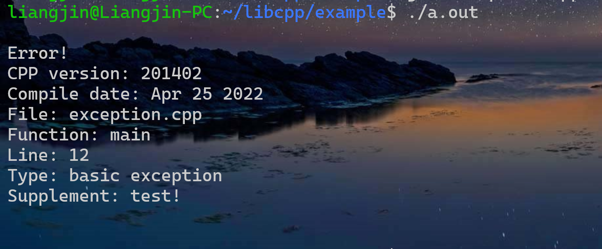

# 异常

在指定位置抛出异常，继承自`std::exception`，位于`exception.hpp`文件中。


## 一、`Exception`类

本程序库中所有异常的基类，继承自`std::exception`。

### 1、成员变量

含有4个成员变量，访问权限均为`protected`：

| 名称 | 类型 | 含义 |
| - | - | - |
| `filename` | `std::string` | 抛出异常时所在的文件名 |
| `function` | `std::string` | 抛出异常的函数 |
| `linenumber` | `int` | 抛出异常的行号 |
| `msg` | `std::string` | 对异常的补充说明 |

### 2、构造与析构

无默认构造函数，构造时必须提供以上四个参数，例如：

```c++
slj::Exception{__FILE__ , __FUNCTION__ , __LINE__ , "test"};
```

默认析构函数，默认复制构造函数。

### 2、成员函数

+ 公有成员函数

```c++
virtual void show()
```

格式化显示异常信息，调用了三个保护成员函数，输出到标准错误流。

### 3、保护成员函数

+ 显示文件名、行号等信息：

```c++
virtual void head();
```

+ 显示异常类型：

```c++
virtual void type();
```

+ 显示补充说明：

```c++
virtual void tail();
```

这三个函数在`show()`中被调用。


## 二、`ErrorLogic`

出现逻辑错误时使用，例如：

+ 速度超光速
+ `switch`语句中`case`缺失

### 1、成员变量

继承自`Exception`类，无成员变量

### 2、构造与析构

与`Exception`类相似。

### 3、保护成员函数

显示异常类型。

```c++
virtual void type();
```


## 三、`ErrorOutflow`

溢出错误时使用，例如：

+ 数组越界
+ 除以0

### 1、成员变量

继承自`Exception`类，无成员变量

### 2、构造与析构

与`Exception`类相似。

### 3、保护成员函数

显示异常类型。

```c++
virtual void type();
```


## 四、`ErrorExpection`

出现非预期错误时使用，例如：

+ 无法打开文件

### 1、成员变量

继承自`Exception`类，无成员变量

### 2、构造与析构

与`Exception`类相似。

### 3、保护成员函数

显示异常类型。

```c++
virtual void type();
```

## 五、宏

为方便使用，对每一个异常类定义了一个对应的宏，抛出异常时直接使用对应的宏即可：

```c++
#define EXCEPTION(msg)              (slj::Exception{__FILE__ , __FUNCTION__ , __LINE__ , (msg)})

#define ERRORLOGIC(msg)             (slj::ErrorLogic{__FILE__ , __FUNCTION__ , __LINE__ , (msg)})

#define ERROROUTFLOW(msg)           (slj::ErrorOutflow{__FILE__ , __FUNCTION__ , __LINE__ , (msg)})

#define ERROREXPECTION(msg)         (slj::ErrorExpection{__FILE__ , __FUNCTION__ , __LINE__ , (msg)})

```

其中`msg`的类型为`std::string`，是对异常的补充说明，其它参数可以通过编译器自动获得。

## 六、使用示例

```c++
std::string msg{"test!"};
try{
    throw EXCEPTION(msg);
    // throw ERRORLOGIC(msg);
    // throw ERROREXPECTION(msg);
    // throw ERROROUTFLOW(msg);
}
catch (slj::Exception & e){
    e.view();
}
catch(std::exception & e){
    std::cerr << e.what() <<std::endl;
}
```

详细代码见`example/exception.cpp`文件，使用`gcc`编译，输出结果如下：



